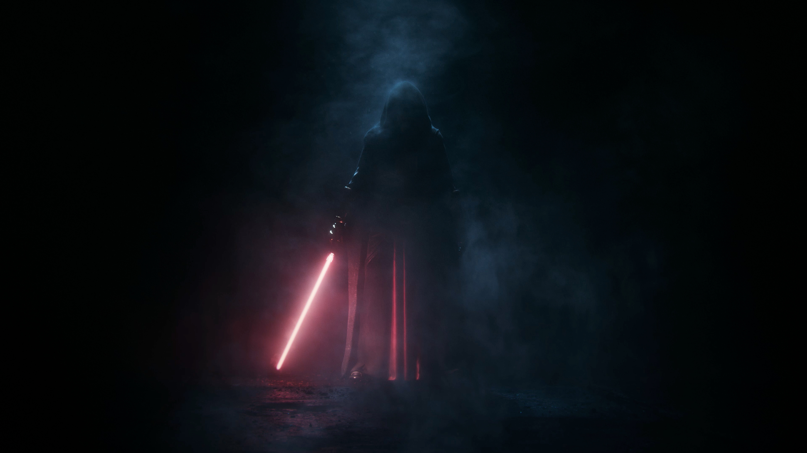

# Star Wars



## Objetivos del Proyecto

- Construir una App utlizando React y Redux
- Aprender mejores prácticas.
- Aprender y practicar el workflow de GIT.

## Comenzando

__IMPORTANTE:__ Es necesario contar minimamente con la última versión estable de Node y NPM. Asegurarse de contar con ella para poder instalar correctamente las dependecias necesarias para correr el proyecto.

Actualmente las versiónes necesarias son:

- __Node__: 12.18.3 o mayor
- __NPM__: 6.14.16 o mayor

Para verificar que versión tienen instalada:

```bash
node -v
npm -v
```

__ACLARACIÓN:__ Las dependencias actuales se encuentran en las versiones que venimos trabajando durante el bootcamp.

Versiones:

- __react__: 18.2.0
- __react-dom__: 18.2.0
- __react-router-dom__: 6.4.1
- __redux__: 4.2.0
- __react-redux__: 8.0.4

## BoilerPlate

El boilerplate cuenta con la carpeta:`front`. En estas carpetas estará el código del front-end respectivamente.


El contenido de `front` fue creado usando: Create React App.

## Enunciado

La idea general es crear una aplicación en la cual se puedan ver los distintos Personajes de start wars:

- Buscar personaje
- Filtrarlos
- Listarlos


#### Tecnologías necesarias

- [ ] React
- [ ] Redux


#### Uso

Para poder iniciar el proyecto debe de realizar el npm install a la carpeta `front` y despues de tener instaladas todas las dependecias debe ejecutar npm start y asi podrias visualizar la aplicacion

